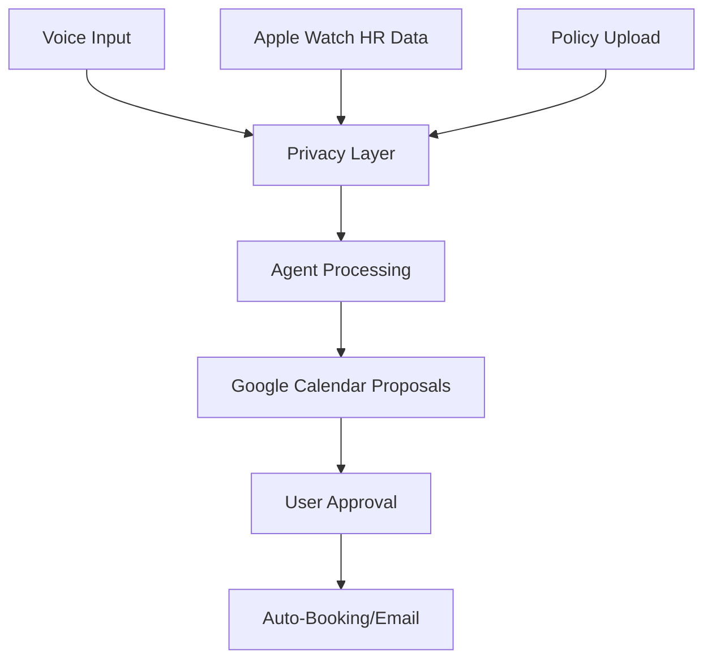
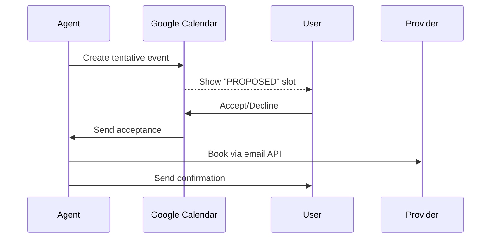

Prompt for Perplexity Labs Projects:

### Healthcal AI: MVP Agent for Automated Healthcare Booking

#### Core Objective
Build an MVP AI agent that automates healthcare appointment booking using voice input, wearable data triggers, and insurance-aware scheduling while maintaining strict Canadian privacy compliance (PIPEDA). The agent will prioritize Apple Watch resting heart rate anomalies and integrate with Google Calendar as its primary UI.

#### Technical Architecture


#### MVP Requirements Prompt
```plaintext
Build a voice-first AI agent that:
1. **Input Handling**
- Processes voice commands (e.g., "Schedule dentist near work next Tuesday")
- Ingests Apple Watch health data via HealthKit API (prioritizing resting heart rate anomalies)
- Accepts uploaded insurance policy PDFs via OCR extraction

2. **Scheduling Intelligence**
- Maintains 2 separate calendar blocks:
- **Routine Care**: Fixed slots for checkups (e.g., 2hrs/month)
- **Acute Care**: Flex slots for urgent needs
- Auto-discovers providers using:
- User-specified priorities (location/gender/language)
- Insurance network validation
- Triggers GP visits when RHR exceeds user's baseline by 15% for 48+ hours

3. **Google Calendar Integration**
- Creates tentative events labeled "PROPOSED: [Service]" with:
- Provider details
- Cost estimates based on insurance
- Map links
- Sends booking confirmation email via Gmail API when user accepts event

4. **Privacy Implementation**
- On-device processing for wearable data (CoreML)
- End-to-end encrypted cloud storage for policy documents
- PIPEDA-compliant data handling (Canadian/British Columbia standards)

5. **Success Tracking**
- Monitor:
- % reduction in missed routine appointments
- Health benefit utilization rate
- # appointments booked via agent

6. **Technical Stack**
- **Voice Processing**: Whisper.cpp for on-device ASR
- **Agent Core**: LangChain with custom tools for calendar/email
- **Wearable Integration**: Apple HealthKit → TensorFlow Lite anomaly detection
- **Privacy**: SQLCipher for local storage, ProtonMail encryption for emails

**Deliverables**:
- Working prototype with Google Calendar sync
- Privacy impact assessment report
- Success metric dashboard prototype
```

#### Key Design Decisions
1. **Privacy-First Architecture**
- Health data never leaves device (Apple Watch → local analysis)
- Policy documents encrypted with AES-256 before cloud storage
- All calendar interactions use OAuth 2.0 limited-scope tokens

2. **Proactive Health Monitoring**
```python
def check_hr_anomaly(current_rhr, baseline):
threshold = baseline * 1.15 # 15% above baseline
if current_rhr > threshold:
return "GP visit recommended"
return None
```

3. **Calendar Integration Workflow**


4. **Compliance Safeguards**
- Auto-delete policy documents after OCR extraction
- Annual PIPEDA compliance audits built-in
- User-controlled data retention periods

#### Next Steps
1. Implement core voice processing pipeline
2. Build Apple Watch RHR monitoring module
3. Develop Google Calendar sync engine
4. Create policy OCR extraction tool
5. Assemble privacy compliance framework

This MVP delivers a privacy-compliant, voice-driven agent that transforms reactive healthcare into proactive management. The prototype can be tested with 20 users in Squamish to validate success metrics before scaling.

Sources
[1] Smart Appointment Scheduler MVP - AI Prompt - DocsBot AI https://docsbot.ai/prompts/programming/smart-appointment-scheduler-mvp
[2] How to use Google Calendar tool & Integration Guide - Insighto.ai https://insightoai.freshdesk.com/support/solutions/articles/1070000065497-how-to-use-google-calendar-tool-integration-guide
[3] "Appointment Booking Assistant"—an AI-powered voice agent https://techcommunity.microsoft.com/blog/azure-ai-services-blog/appointment-booking-assistant%E2%80%94an-ai-powered-voice-agent/4408554
[4] Papers with Code - Transforming Wearable Data into Health Insights using Large Language Model Agents https://paperswithcode.com/paper/transforming-wearable-data-into-health
[5] How I built an AI Agent for appointment ccheduling in healthcare https://www.reddit.com/r/ArtificialInteligence/comments/1g0g5bt/how_i_built_an_ai_agent_for_appointment/
[6] Vapi - Build Advanced Voice AI Agents https://vapi.ai/custom-agents/primary-care-booking-agent
[7] How to Build an AI Agent to Simplify Appointment Scheduling in ... https://qubinets.com/how-to-build-an-ai-agent-for-appointment-scheduling/
[8] Healthcare MVP Guide | Steps, Tips, and Mistakes to Avoid https://www.lowcode.agency/blog/healthcare-mvp-guide
[9] AI Agents For Pharmacy & Healthcare https://springsapps.com/ai-agents-for-pharmacy-healthcare
[10] e-ISSN: 2582-5208 https://www.irjmets.com/uploadedfiles/paper/issue_5_may_2025/75204/final/fin_irjmets1746256625.pdf
