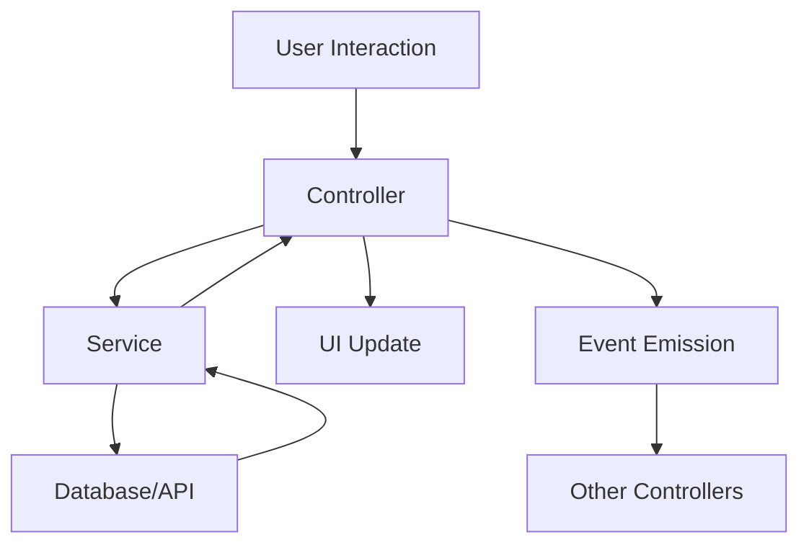

# HealthSync AI Architecture Documentation

## Overview

HealthSync AI follows a modern, modular architecture designed for maintainability, scalability, and team collaboration. The application uses a controller-service pattern with clear separation of concerns.

## Architecture Principles

### 1. Separation of Concerns
- **Controllers**: Handle UI interactions and user events
- **Services**: Contain business logic and data operations
- **Models**: Data structures and validation (implicit in services)
- **Views**: HTML templates and CSS styling

### 2. Dependency Injection
Services are injected into controllers, making the code testable and modular:

```javascript
class UploadController {
  constructor() {
    this.fileUploadService = new FileUploadService();
    this.insuranceService = new InsuranceService();
  }
}
```

### 3. Event-Driven Communication
Controllers communicate through custom events, reducing coupling:

```javascript
// Emit event
this.emit('uploadComplete', data);

// Listen for event
this.on('uploadComplete', this.handleUploadComplete.bind(this));
```

## Component Structure

### Controllers Layer

#### AppController
- **Purpose**: Main application coordinator
- **Responsibilities**: 
  - Initialize all other controllers
  - Set up inter-controller communication
  - Handle application-level state

#### PageManager
- **Purpose**: Manage page navigation and visibility
- **Responsibilities**:
  - Show/hide pages
  - Track current page state
  - Emit page change events

#### Feature Controllers
Each major feature has its own controller:
- `UploadController`: File upload and processing
- `QuestionnaireController`: Health preferences questionnaire
- `CalendarController`: Appointment calendar display
- `ModalController`: Modal dialogs and interactions

### Services Layer

#### DatabaseService
- **Purpose**: Supabase integration and data operations
- **Features**:
  - Connection management
  - Generic CRUD operations
  - Fallback to demo mode when offline

#### Business Logic Services
- `FileUploadService`: File validation and processing
- `InsuranceService`: Insurance document OCR and analysis
- `QuestionnaireService`: Question management and validation
- `AppointmentService`: Appointment CRUD operations
- `ProviderService`: Healthcare provider management
- `SchedulingService`: AI-powered appointment scheduling

## Data Flow



## Error Handling Strategy

### 1. Service Level
Services return structured error objects:
```javascript
return { data: null, error: 'Database connection failed' };
```

### 2. Controller Level
Controllers handle errors gracefully:
```javascript
try {
  const result = await this.service.operation();
  this.handleSuccess(result);
} catch (error) {
  this.handleError(error);
}
```

### 3. User Level
Users see friendly error messages, not technical details.

## State Management

### Local State
Each controller manages its own state:
- Current question index
- User answers
- Selected appointments

### Shared State
Shared through events and service calls:
- User preferences
- Insurance data
- Generated schedule

## Testing Strategy

### Unit Testing
- Test services independently
- Mock dependencies
- Test error conditions

### Integration Testing
- Test controller-service interactions
- Test event communication
- Test UI updates

### End-to-End Testing
- Test complete user workflows
- Test across different browsers
- Test responsive design

## Performance Considerations

### Code Splitting
- Modular architecture enables easy code splitting
- Controllers can be loaded on demand
- Services can be lazy-loaded

### Caching
- Service results are cached where appropriate
- Database queries are optimized
- Static assets are cached

### Bundle Size
- Tree shaking eliminates unused code
- Services are only loaded when needed
- External dependencies are minimized

## Security Considerations

### Data Validation
- All user inputs are validated
- File uploads are strictly validated
- Database queries use parameterized statements

### Privacy
- Sensitive data is processed client-side when possible
- Database connections use environment variables
- User data is encrypted in transit and at rest

## Deployment Architecture

### Development
- Vite dev server for hot reloading
- Local Supabase instance for testing
- Environment-based configuration

### Production
- Static site deployment (Netlify, Vercel)
- Supabase cloud for database
- CDN for asset delivery

## Future Enhancements

### Scalability
- Service worker for offline functionality
- Background sync for data updates
- Progressive Web App features

### Monitoring
- Error tracking integration
- Performance monitoring
- User analytics

### Features
- Real-time notifications
- Multi-language support
- Advanced AI scheduling algorithms

## Development Guidelines

### Adding New Features

1. **Create Service First**
   ```javascript
   // services/NewFeatureService.js
   export class NewFeatureService {
     async performOperation() {
       // Business logic here
     }
   }
   ```

2. **Create Controller**
   ```javascript
   // controllers/NewFeatureController.js
   export class NewFeatureController {
     constructor() {
       this.service = new NewFeatureService();
     }
   }
   ```

3. **Register in AppController**
   ```javascript
   this.controllers.newFeature = new NewFeatureController();
   ```

4. **Set Up Communication**
   ```javascript
   this.controllers.newFeature.on('featureComplete', this.handleFeatureComplete);
   ```

### Code Style

- Use ES6+ features
- Prefer async/await over promises
- Use meaningful variable names
- Add JSDoc comments for public methods
- Follow consistent error handling patterns

### File Organization

- One class per file
- Group related functionality
- Use descriptive file names
- Maintain consistent directory structure

This architecture provides a solid foundation for building scalable, maintainable healthcare applications while ensuring code quality and team collaboration.